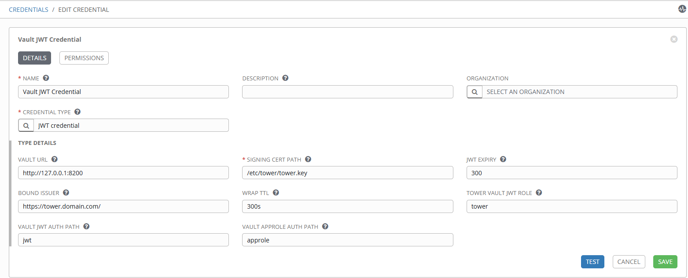
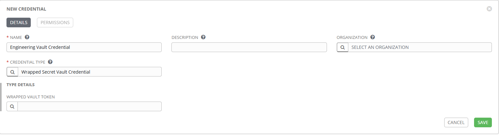
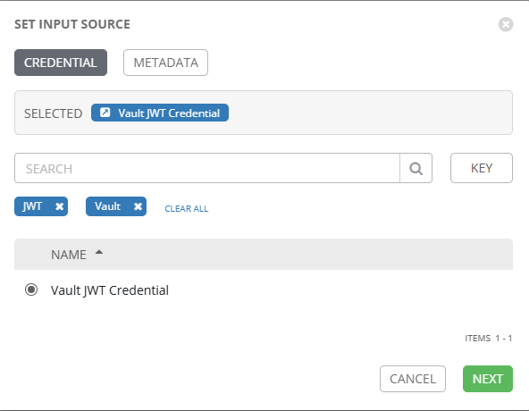
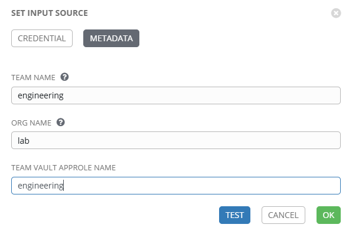

# HashiCorp Vault JWT Credential Plugin

This AAP plugin is intended to allow a Tower Credential to provide a wrapped secret-id for a pre-defined role to a playbook. This is achieved by the credential plugin issuing a JWT, authenticating to Vault using the JWT auth method, and then issuing a wrapped secret-id which is made availabe within the playbook using the WRAPPED_VAULT_TOKEN env variable.

## Why use this type of credential plugin?

"Secret-zero" is a common challenge when managing Vault AppRole credentials - how do you securely pre-seed the secret-id into a process without just storing the secret-id somewhere else? Within Tower/AAP that's a common problem one would face since all the existing solutions rely on manually storing the secret-id in a credential or even storing it within an Ansible Vault. Not ideal right?

This plugin attempts to create a more secure way to provide Vault credentials to a playbook by allowing Tower/AAP to act as a "trusted orchestrator" to issue Vault secrets. The playbooks get a single-use, wrapped secret-id tied to the AppRole they need access to.

## How does this plugin work?

The basic flow is as follows:

1. On playbook execute, Tower/AAP uses the credential plugin to create a JWT.
2. The credential plugin calls Vault to login using the JWT and a specific, locked-down vault policy is attached to the token
3. The token is used to request a wrapped secret-id for the playbook's approle.
4. The wrapped token is provided to the playbook as an environment variable which the playbook can unwrap and use to authenticate to vault to retrieve any other credentials the approle has access to.

## Configuring the credential

A shared Credential plugin needs to be created once the plugin is installed. This acts as the unified auth source for Tower to Vault.


Once that is done, you'll need to create a new Credential type. This will again be a shared credential type.

Input Configuration

```yaml
fields:
  - id: wrapped_vault_token
    type: string
    label: Wrapped Vault Token
```

Injector Configuration

```yaml
env:
  WRAPPED_VAULT_TOKEN: "{{ wrapped_vault_token }}"
```

Create a new Credential for the approle that needs playbook secrets. The credential type is the one that you created in the previous step.



Select the Vault JWT Credential in the "Wrapped Vault Token" field. Click Next.



Here is where you set the team/approle-specific credential information. The first two fields map to the bound claims that are inserted into the JWT that Tower creates. It gives some flexibility on the Vault side so you can have different JWT roles based on org or even approle/team if desired. The `Team Vault Approle Name` field defines the name of the AppRole that the playbooks need access to. When the playbooks run, they are given a single-use, wrapped secret-id tied to this approle. (**Note that this is _not_ the role-id. It is the AppRole name.**)



> [!WARNING]
> You must set the permissions of the credential as read-only ad viewable only by the team that using the AppRole. General users cannot have the ability to set their own AppRole name in the credential or they _could_ authenticate to an ApprRole they shouldn't. Yes, they would also need the role-id to propertly authenticate (which is why AppRole is the prefered method), but it's always important to reduce unnecessary secret access.

---

**_NOTE BEFORE INSTALLING THIS PLUGIN_**

This plugin uses the jwt python module which can use a newer version of cryptography. There are some instances where this causes the cryptogrphay module to update past a version that the installed openssl version supports.

It is _strongly_ advised to check wither your venv is using at least pyopenssl 22.0.0 or later and upgrade to at least this version if necessary.

---

To install the plugin:

1.  Copy the files from this repo onto the AAP controller nodes.
2.  From a terminal session on each AAP controller node, cd to the folder you've copied the code to.
3.  Install the Python code in the AAP virtualenv on _each_ controller node:

```shell
awx-python -m pip install .
```

4.  From _any_ AAP controller node, run this command to register the plugin:

```shell
awx-manage setup_managed_credential_types
```

5.  Restart the AAP services:

```shell
automation-controller-service restart
```

Required Vault Configuration:

1.  [JWT auth method](https://developer.hashicorp.com/vault/api-docs/auth/jwt#configure) enabled & configured with the pub key of the signing key used by Tower (configured in the Tower Credential).
2.  [JWT Role](https://developer.hashicorp.com/vault/api-docs/auth/jwt#create-update-role) for the Tower connection
3.  A policy for the JWT role to use
4.  AppRole auth method + roles for playbooks to use

---

To-Do:

1. Add a diagram and process flow to README.
2. Add support for passing JWT signing key in a text field within the credential page in Tower.
3. Add fields for custom ttls for the JWT & wrapped token.
4. Tutorial for creating the credential in Tower, how it will be used within a playbook, and the guardrails that need to be in place to ensure the solution is secure.
